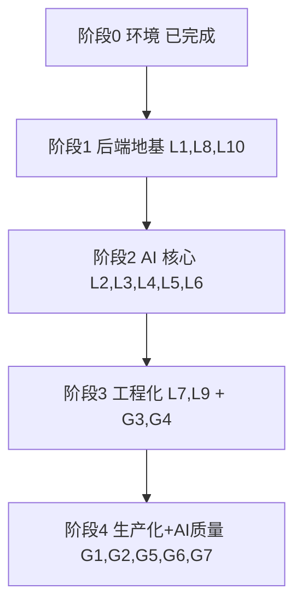

# 学习行动计划 — 从前端到 Java + AI 全栈

> **我是谁**：在职前端（React + TS 熟练），有一定 Java 基础，正把能力边界从前端向 Java 后端 + AI 应用全栈扩展。
> **学习载体**：本仓库（Spring Boot 4.1 + Java 21 + Spring AI 2.0 + PostgreSQL/pgvector + Redis + React）。
> **我的方式（learning in public）**：公开记录「读懂真实实现 → 补齐背后概念 → 动手改一点 → 沉淀成可复用笔记」的全过程，把踩过的坑和验证结论都开源出来，让走同一条路（前端转 Java + AI）的人少走弯路。
> **修订（2026-07-16）**：重构为「先吃透本项目的 Java AI 全栈实现，再补齐它没覆盖的生产化能力」。

---

## 一、我要建立的 AI 全栈能力地图

下面是我梳理的「一个 Java AI 全栈应用需要哪些能力」，以及本项目的覆盖情况——这也是我判断「先学什么、还缺什么」的依据。

| 能力域 | 具体内容 | 本项目 |
|--------|----------|:------:|
| Java 后端地基 | Spring Boot 分层、DI、JPA、事务、统一响应/异常、配置管理 | ✅ 完整 |
| LLM 接入 | 多 Provider、ChatClient、流式、结构化输出、重试 | ✅ 完整 |
| Prompt 工程 | 模板管理、注入防护、结构化约束 | ✅ 有 |
| RAG | 向量库、embedding、检索、Query Rewrite、TopK/阈值 | ✅ 完整 |
| Agent / 工具调用 | tool-calling、技能编排 | ✅ 有（agent-utils） |
| 异步 / 消息 | 队列解耦、可靠消费、重试/死信 | ✅ Redis Stream |
| 实时通信 | WebSocket / SSE 流式 | ✅ 完整 |
| 可观测性 | 指标、健康检查（追踪待补） | 🟡 半 |
| 工程质量 | 限流、异常体系、测试 | 🟡 半 |
| 生产化 | 认证鉴权、DB 迁移、部署、CI/CD | ❌ 缺 |
| AI 质量保障 | 评测/eval、幻觉与检索质量度量 | 🟡 有评分无 eval |
| 前端对接 | SSE/WebSocket、类型安全、流式 UI | ✅ 完整 |

本项目已经覆盖了其中大部分核心能力，我先把这些真实实现吃透；剩下的「生产化 + AI 质量保障」是项目里没有的，我自己动手补上并公开记录——这两块既是我最想搞懂的，也是笔记里对他人最有参考价值的干货。

---

## 二、本项目里我要系统深挖的技术亮点（L 系列）

> 每个亮点 = 读源码 → 建立概念 → 做一个小验证 → 沉淀笔记。按 # 顺序推进；「笔记」列对应 [第五节](#五笔记索引按-l--g-分类) 的文件。

| # | 主题 | 读什么（核心源码） | 要建立的概念 | 我的小验证 | 笔记 |
|---|------|-------------------|-------------|-----------|:--:|
| L0 | 环境与工程基建 ✅ | `docker-compose.dev.yml`、启动日志 | Compose 编排、端口/依赖排查、ddl-auto 陷阱 | 已完成 | `01`·`07` |
| L1 | Spring Boot 三层地基 | `interview` 模块 Controller/Service/Repository；`common/result`、`common/exception`、`common/config/*Properties` | DI 与构造器注入、`@Transactional` 边界、派生查询、`Result<T>`、全局异常体系 | 加一个派生查询 + 单测；讲清「事务不含 LLM/HTTP」 | `10` |
| L2 | Spring AI 多 Provider | `common/ai/LlmProviderRegistry`、`LlmProviderProperties`、`ApiPathResolver`、`modules/llmprovider/*` | `ChatClient`/`ChatModel`、OpenAI 兼容协议、Advisor、多 Provider 抽象、密钥加密 | 加一个 OpenAI 兼容 Provider，验证运行时切换/回退 | `02` |
| L3 | 结构化输出与可靠性 | `common/ai/StructuredOutputInvoker`、`StructuredOutputProperties`、`ResumeGradingService` | LLM JSON 不可靠、`BeanOutputConverter`、重试/降级、判别边界 | 制造坏 JSON，观察重试与指标变化 | `02` |
| L4 | Prompt 工程与注入防护 | `common/ai/PromptSanitizer`、`PromptSecurityConstants`、`resources/prompts/*.st` | 模板化管理、注入攻击与防护、system/user 分离 | 写恶意输入用例验证 sanitizer | `11` |
| L5 | RAG 检索增强全链路 | `knowledgebase/service/KnowledgeBaseVectorService`、`KnowledgeBaseQueryService`、`listener/VectorizeStream*` | embedding 维度/COSINE、HNSW、分块、Query Rewrite、TopK/阈值、召回 vs 精度 | 调 chunk/TopK，人工对比检索差异（为 G5 打基础） | `04` |
| L6 | Agent / 工具调用 | `common/ai/AgentUtilsConfiguration`、Registry 的 tools/voice 变体、`resources/skills/` | tool-calling 原理、工具注册与编排、Agent vs 纯 RAG | 画一次「LLM 决定调用工具 → 执行 → 回填」时序 | `12` |
| L7 | Redis Stream 异步 | `common/async/AbstractStreamProducer`/`Consumer`、`infrastructure/redis/RedisService`、各模块 `listener/` | 消费者组、ACK、Pending 回收、死信、幂等、为何不用 `@Async` | 给一个新任务类型走一遍模板 | `05` |
| L8 | 限流与横切（AOP） | `common/aspect/RateLimitAspect`（Lua + Redisson）、`common/annotation/RateLimit` | AOP 切面、注解驱动、Lua 原子限流、多维度（GLOBAL/IP/SESSION） | 给接口加 `@RateLimit` 压测触发 | `13` |
| L9 | 实时语音 WebSocket | `voiceinterview/handler/VoiceInterviewWebSocketHandler`、`QwenAsrService`/`QwenTtsService`/`DashscopeLlmService`、`WebSocketConfig` | WebSocket/SSE/WebRTC、ASR→LLM→TTS 级联、边生成边合成、首包延迟 | 标注一轮对话各段 Micrometer 指标 | `06` |
| L10 | 统一评估 + 文件/导出 | `common/evaluation/UnifiedEvaluationService`、`infrastructure/file/*`、`export/`、`mapper/` | 文字/语音共用评估、S3 兼容存储、Tika 解析、MapStruct | 读懂评估装配与文件解析链路 | `03` |

> 备注：`notes/08-interview-list-projection.md` 记录了一次列表查询的 JPQL 投影分析（`findAll()` 整行加载 → 只查 DTO 列），属常规查询优化，作为顺带的小知识留档，不单列为学习任务。

---

## 三、本项目没覆盖、我要补齐的工程化能力（G 系列）

> 这些是本项目**没有或很弱**、但一个能真正上线的 AI 应用绕不开的能力。

| # | 主题 | 现状 → 我要加什么 | 我的验收 | 笔记 |
|---|------|------------------|----------|:--:|
| G1 | 认证与鉴权 | 接口裸奔 → `spring-boot-starter-security` + JWT 登录 + `SecurityFilterChain` + `@PreAuthorize`，按用户隔离 | 未登录 401、越权 403、`/api/**` 需 token | `20` |
| G2 | 数据库迁移 | 靠 ddl-auto（`notes/07` 踩过丢数据）→ Flyway `V1__init.sql`，`ddl-auto` 改 `validate` | 重启不依赖自动建表、可版本化回滚 | `21` |
| G3 | 分布式追踪与日志 | 只有指标 → `micrometer-tracing` + OTel/Zipkin，日志加 MDC，覆盖一次 RAG/简历链路 | 一次请求能看到跨 Service/Stream 的 span | `22` |
| G4 | 测试体系 | Redis 测试多 `@Disabled` → Testcontainers 起真 Redis/PG，Mock S3/LLM 跑全链路 | `./gradlew :app:test` 默认跑通链路（PENDING→COMPLETED/FAILED） | `05` 增补 |
| G5 | AI 质量评估 | 有评分无 eval → 建 20~30 条评测集，Java 内 LLM-as-judge 度量 faithfulness/命中率 | 「参数改动 → 指标变化」对比表 + 结论 | `23` |
| G6 | 容器化与 CI | 有 compose 无流水线 → 多阶段 `Dockerfile` + 全栈 compose + GitHub Actions | 一条命令起全栈、PR 触发 CI（build + test） | `24` |
| G7 | SSE 流式可靠性 | 断网丢已渲染内容 → `frontend/src/api/stream.ts` 指数退避重试 + 内容保留/按 messageId 补齐 | 断网可恢复且不丢已渲染内容 | `04` 增补 |

---

## 四、分阶段学习路线

| 阶段 | 目标 | 学习项 | 主要产出 |
|------|------|--------|----------|
| 1 后端地基 | 能读懂/改任一模块 | L1、L8、L10 | notes 10、13 + 03 增补 |
| 2 AI 核心 | 掌握 LLM/RAG/Agent | L2、L3、L4、L5、L6 | notes 02、04、11、12 增补 |
| 3 工程化 | 异步/实时/可观测/可测 | L7、L9、G3、G4 | notes 05、06、22 + 集成测试 |
| 4 生产化 | 认证/迁移/评估/部署 | G1、G2、G5、G6、G7 | notes 20~24 |

**我的执行原则**：
1. 每个学习项先「读代码 + 画一张图」再动手，不让自己停在「看过但没懂」
2. 小改动优先（加一个方法/一条测试/一个配置），先跑通再深入
3. 每项沉淀一篇公开笔记，写到「别人照着能复现、能看懂」的程度——这是我践行 learning in public 的方式
4. 生产化缺口（G 系列）是我重点投入的部分，也是我最想帮到同路人的干货

---

## 五、笔记索引（按 L / G 分类）

**编号约定**

- `notes/01–08`：L/G 拆分前已沉淀的基础笔记，**保留原文件名**以稳定链接（已公开、被多处引用，不重命名）。
- `notes/10–19`：**L 系列**（深挖项目已有亮点）新增笔记段。
- `notes/20–29`：**G 系列**（补齐工程化能力）新增笔记段。
- 一篇笔记可服务多个 L/G 项（如 `02` 覆盖 L2+L3、`04` 覆盖 L5+G7、`05` 覆盖 L7+G4）。

**L 系列 · 深挖项目已有亮点**

| 项 | 笔记 | 状态 |
|----|------|:--:|
| L0 | `01-env-setup` · `07-jpa-ddl-auto` | ✅ 完成 |
| L1 | `10-spring-backend-foundations` | ⬜ 待新增 |
| L2 · L3 | `02-spring-ai-provider` | 🟡 已有，待增补 |
| L4 | `11-prompt-engineering-security` | ⬜ 待新增 |
| L5 | `04-rag-pipeline` | 🟡 已有，待增补 |
| L6 | `12-agent-tool-calling` | ⬜ 待新增 |
| L7 | `05-redis-stream-async` | 🟡 已有，待增补 |
| L8 | `13-rate-limit-aop` | ⬜ 待新增 |
| L9 | `06-voice-interview` | 🟡 已有，待增补 |
| L10 | `03-unified-evaluation` | 🟡 已有，待增补 |
| —（留档） | `08-interview-list-projection` | ✅ 留档，非任务 |

**G 系列 · 补齐工程化能力**

| 项 | 笔记 | 状态 |
|----|------|:--:|
| G1 | `20-spring-security-jwt` | ⬜ 待新增 |
| G2 | `21-flyway-migration` | ⬜ 待新增 |
| G3 | `22-tracing-observability` | ⬜ 待新增 |
| G4 | `05-redis-stream-async`（增补集成测试章节） | ⬜ 待增补 |
| G5 | `23-rag-evaluation` | ⬜ 待新增 |
| G6 | `24-docker-cicd` | ⬜ 待新增 |
| G7 | `04-rag-pipeline`（增补 SSE 可靠性章节） | ⬜ 待增补 |

代码改动按 `code-changes/` 目录组织，命名沿用同一约定；G 系列每完成一项，新增对应目录与 diff。

---

## 六、成果主线：走完这条路我能讲清楚、也能教别人的能力

这条路径走完，我希望能把下面每一块都讲清楚原理、说明白取舍，并通过公开笔记帮到同样从前端补齐 Java 后端 + AI 的人：

- **Java AI 全栈**：基于 Spring Boot 4 + Spring AI 2，读懂并动手扩展多 Provider LLM 接入、结构化输出容错、RAG（pgvector）、tool-calling 与实时语音（WebSocket）全链路
- **工程化**：Redis Stream 异步任务（ACK/重试/死信/XAUTOCLAIM 回收）、AOP + Lua 分布式限流、Micrometer 指标与分布式追踪
- **生产化**：Spring Security + JWT 鉴权、Flyway 迁移、Testcontainers 集成测试、Docker + CI
- **AI 质量**：为 RAG 建评测集并用数据驱动调参（faithfulness/命中率），把「改得好不好」量化下来
- **前端衔接**：React + TS 的 SSE/WebSocket 流式 UI 与断连恢复
