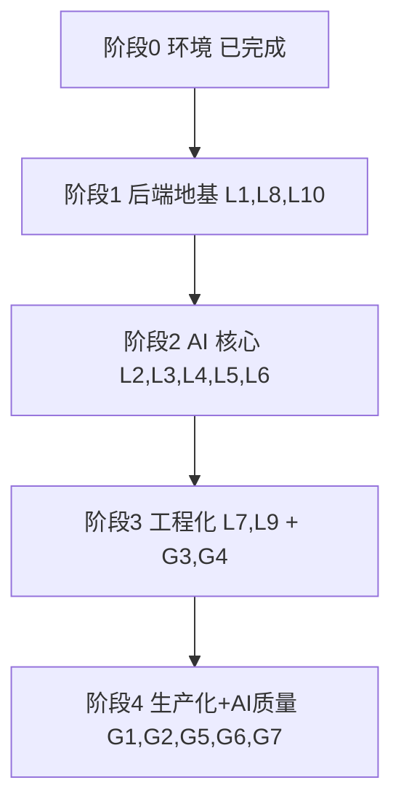

# 学习行动计划 — 从前端到 Java + AI 全栈

> **我是谁**：在职前端（React + TS 熟练），有一定 Java 基础，正把能力边界从前端向 Java 后端 + AI 应用全栈扩展。
> **学习载体**：本仓库（Spring Boot 4.1 + Java 21 + Spring AI 2.0 + PostgreSQL/pgvector + Redis + React）。
> **我的方式（learning in public）**：公开记录「读懂真实实现 → 补齐背后概念 → 动手改一点 → 沉淀成可复用笔记」的全过程，把踩过的坑和验证结论都开源出来，让走同一条路（前端转 Java + AI）的人少走弯路。
> **修订（2026-07-16）**：重构为「先吃透本项目的 Java AI 全栈实现，再补齐它没覆盖的生产化能力」。

---

## 一、我要建立的 AI 全栈能力地图

下面是我梳理的「一个 Java AI 全栈应用需要哪些能力」，以及本项目的覆盖情况——这也是我判断「先学什么、还缺什么」的依据。

| 能力域 | 具体内容 | 本项目 |
|--------|----------|:------:|
| Java 后端地基 | Spring Boot 分层、DI、JPA、事务、统一响应/异常、配置管理 | ✅ 完整 |
| LLM 接入 | 多 Provider、ChatClient、流式、结构化输出、重试 | ✅ 完整 |
| Prompt 工程 | 模板管理、注入防护、结构化约束 | ✅ 有 |
| RAG | 向量库、embedding、检索、Query Rewrite、TopK/阈值 | ✅ 完整 |
| Agent / 工具调用 | tool-calling、技能编排 | ✅ 有（agent-utils） |
| 异步 / 消息 | 队列解耦、可靠消费、重试/死信 | ✅ Redis Stream |
| 实时通信 | WebSocket / SSE 流式 | ✅ 完整 |
| 可观测性 | 指标、健康检查（追踪待补） | 🟡 半 |
| 工程质量 | 限流、异常体系、测试 | 🟡 半 |
| 生产化 | 认证鉴权、DB 迁移、部署、CI/CD | ❌ 缺 |
| AI 质量保障 | 评测/eval、幻觉与检索质量度量 | 🟡 有评分无 eval |
| 前端对接 | SSE/WebSocket、类型安全、流式 UI | ✅ 完整 |

本项目已经覆盖了其中大部分核心能力，我先把这些真实实现吃透；剩下的「生产化 + AI 质量保障」是项目里没有的，我自己动手补上并公开记录——这两块既是我最想搞懂的，也是笔记里对他人最有参考价值的干货。

---

## 二、本项目里我要系统深挖的技术亮点

> 每个亮点 = 我读了哪些文件 +  建立了哪些概念 + 我做的小验证 + 产出的笔记。我按下面顺序推进。

### L0. 环境与工程基建 ✅（已完成）

见 `notes/01-env-setup.md`、`notes/07-jpa-ddl-auto.md`、`notes/08-interview-list-projection.md`。已掌握：Docker Compose 编排、端口/依赖排查、ddl-auto 陷阱、JPQL 投影优化。

### L1. Spring Boot 三层架构地基

- **读**：任一模块的 `Controller → Service → Repository`，如 `modules/interview/InterviewController.java`、`service/InterviewPersistenceService.java`、`repository/InterviewSessionRepository.java`
- **概念**：依赖注入与构造器注入（`@RequiredArgsConstructor`）、`@Transactional` 边界、`JpaRepository` 派生查询、`record` 请求/响应、`Result<T>` 统一响应、`GlobalExceptionHandler` + `BusinessException` + `ErrorCode` 异常体系
- **对应文件**：`common/result/Result.java`、`common/exception/*`、`common/config/*Properties.java`（`@ConfigurationProperties` 配置绑定）
- **我的小验证**：给某个查询加一个派生查询方法 + 单测；讲清「为什么事务里不能包 LLM/HTTP 调用」
- **产出**：`notes/10-spring-backend-foundations.md`

### L2. Spring AI 接入与多 Provider 管理

- **读**：`common/ai/LlmProviderRegistry.java`（ChatClient 缓存、默认 Provider 回退、plain/tools/voice 三变体、advisor 装配、运行时 refresh）、`common/config/LlmProviderProperties.java`、`common/ai/ApiPathResolver.java`、`modules/llmprovider/*`（Provider 配置落库、Bootstrap 播种、API Key 加密）
- **概念**：`ChatClient`/`ChatModel` 区别、OpenAI 兼容协议、Advisor 机制、多 Provider 抽象、密钥加密存储
- **我的小验证**：新增一个 OpenAI 兼容 Provider（仅配置），验证运行时切换与回退
- **产出**：补充 `notes/02-spring-ai-provider.md`

### L3. 结构化输出与可靠性

- **读**：`common/ai/StructuredOutputInvoker.java`（重试循环、错误注入重试提示、schema validation、指标 `app.ai.structured_output.*`）、`StructuredOutputProperties.java`、`resume/service/ResumeGradingService.java`（`BeanOutputConverter` 实战）
- **概念**：为什么 LLM 的 JSON 不可靠、`BeanOutputConverter`、重试与降级、LLM-as-判别的边界
- **我的小验证**：故意让模型输出坏 JSON，观察重试与指标变化
- **产出**：补充 `notes/02-spring-ai-provider.md` 结构化输出章节

### L4. Prompt 工程与注入防护

- **读**：`common/ai/PromptSanitizer.java`、`PromptSecurityConstants.java`、`resources/prompts/*.st`（StringTemplate 模板）
- **概念**：Prompt 模板化管理、注入攻击与防护、system/user 职责分离
- **我的小验证**：写一个恶意输入用例，验证 sanitizer 行为
- **产出**：`notes/11-prompt-engineering-security.md`

### L5. RAG 检索增强全链路

- **读**：`modules/knowledgebase/service/KnowledgeBaseVectorService.java`（分批向量化、metadata、pgvector 存储）、`KnowledgeBaseQueryService.java`（Query Rewrite、按 query 长度调 TopK/阈值）、`KnowledgeBaseQueryProperties.java`、`listener/VectorizeStream*`（异步向量化）
- **概念**：embedding 维度/距离（COSINE、dim 1024）、HNSW 索引、分块策略、Query Rewrite、TopK 与相似度阈值、召回 vs 精度
- **我的小验证**：调一次 chunk size 或 TopK，人工对比检索结果差异（为 G5 的 eval 打基础）
- **产出**：补充 `notes/04-rag-pipeline.md`

### L6. Agent / 工具调用（tool-calling）

- **读**：`common/ai/AgentUtilsConfiguration.java`、`LlmProviderRegistry` 里 voice/tools 变体的 advisor 装配、`resources/skills/`
- **概念**：function/tool calling 原理、工具注册与编排、何时用 Agent vs 纯 RAG
- **我的小验证**：读懂一次带工具的调用链路，画出「LLM 决定调用工具 → 执行 → 回填」时序
- **产出**：`notes/12-agent-tool-calling.md`

### L7. Redis Stream 异步任务体系

- **读**：`common/async/AbstractStreamProducer.java`/`AbstractStreamConsumer.java`、`infrastructure/redis/RedisService.java`（`autoClaim`/`XAUTOCLAIM` 回收）、`constant/AsyncTaskStreamConstants.java`、各模块 `listener/`
- **概念**：生产者/消费者组、ACK、Pending 回收、重试与 FAILED 死信、幂等与实体存在性校验、为何不用 `@Async`
- **我的小验证**：给一个新任务类型走一遍 Producer/Consumer 模板
- **产出**：补充 `notes/05-redis-stream-async.md`

### L8. 限流与横切能力（AOP）

- **读**：`common/aspect/RateLimitAspect.java`（Lua 脚本 + Redisson）、`common/annotation/RateLimit.java`
- **概念**：AOP 切面、注解驱动、Redis + Lua 原子限流、多维度（GLOBAL/IP/SESSION）
- **我的小验证**：给某接口加 `@RateLimit`，用脚本压测触发限流
- **产出**：`notes/13-rate-limit-aop.md`

### L9. 实时语音（WebSocket 全双工 + 流式管线）

- **读**：`modules/voiceinterview/handler/VoiceInterviewWebSocketHandler.java`（连接生命周期、VAD 断句、LLM 流式→句子级并发 TTS、回声防护、Micrometer 埋点）、`service/QwenAsrService.java`/`QwenTtsService.java`/`DashscopeLlmService.java`、`config/WebSocketConfig.java`
- **概念**：WebSocket vs SSE vs WebRTC、级联管线（ASR→LLM→TTS）、边生成边合成边播、首包延迟优化
- **我的小验证**：读懂一轮对话的时序，标注各段 Micrometer 指标
- **产出**：补充 `notes/06-voice-interview.md`

### L10. 统一评估引擎与文件/导出基建

- **读**：`common/evaluation/UnifiedEvaluationService.java`、`EvaluationReport.java`；`infrastructure/file/*`（`FileStorageService` S3、`DocumentParseService` Tika、`FileHashService` 去重）、`infrastructure/export/` iText PDF、`infrastructure/mapper/` MapStruct
- **概念**：文字/语音面试共用评估、S3 兼容存储、文档解析、对象映射
- **产出**：补充 `notes/03-unified-evaluation.md`

---

## 三、本项目没覆盖、我要额外补齐的生产化能力

> 这些是本项目**没有或很弱**、但一个能真正上线的 AI 应用绕不开的能力。项目里没有现成代码可读，所以我自己动手加、再完整写成笔记——这部分最能体现我从「跑通」到「做扎实」的过程，也是我笔记里最想帮到他人的干货。

### G1. 认证与鉴权（Spring Security + JWT）❌ 项目当前无

- **为什么补**：任何真实系统都要登录与权限，当前项目所有接口都是裸奔的；我想把它做成有用户隔离的应用
- **怎么做**：引入 `spring-boot-starter-security`，实现 JWT 登录、`SecurityFilterChain`、方法级 `@PreAuthorize`，把面试/知识库接口按用户隔离
- **我的验收**：未登录 401、越权 403、`/api/**` 需 token；`notes/20-spring-security-jwt.md`

### G2. 数据库迁移（Flyway）❌ 项目当前靠 ddl-auto

- **为什么补**：生产环境不能让 `ddl-auto` 自动改表（我在 `notes/07` 里踩过重启丢数据的坑），版本化迁移是绕不开的一环
- **怎么做**：引入 Flyway，把现有表结构固化为 `V1__init.sql`，`ddl-auto` 改 `validate`
- **我的验收**：重启不再依赖自动建表；迁移可版本化回滚；`notes/21-flyway-migration.md`

### G3. 分布式追踪与结构化日志 🟡 只有指标

- **为什么补**：AI 调用链路很长（HTTP→Stream→LLM→DB），出问题时我要能把一次请求串起来看
- **怎么做**：加 `micrometer-tracing` + OpenTelemetry（或 Zipkin），给一次 RAG/简历分析链路打 traceId；日志加 MDC
- **我的验收**：一条请求能在追踪里看到跨 Service/Stream 的 span；`notes/22-tracing-observability.md`

### G4. 测试体系（单测 + 集成 + Testcontainers）🟡 偏弱、多 @Disabled

- **为什么补**：当前 Redis 相关测试常被 `@Disabled`，我想让核心链路能自动回归验证
- **怎么做**：用 Testcontainers 起真实 Redis/PG，写「简历分析全链路」集成测试（Mock S3/LLM，验证 PENDING→COMPLETED / FAILED）
- **我的验收**：`./gradlew :app:test` 默认可跑通链路测试；`notes/05` 增补集成测试章节

### G5. AI 质量评估 / Eval 🟡 有面试评分、无检索/答案 eval

- **为什么补**：这是 AI 应用与普通后端最大的区别——**要能量化「答得好不好」**。这也是我最想搞懂、最值得公开记录的一块
- **怎么做（Java 内实现，不引 Python）**：为 RAG 建一个小评测集（20~30 条 Q + 期望要点），实现 faithfulness / 命中率的度量（用固定裁判模型做 LLM-as-judge），做一次 chunk/TopK 调参前后对比
- **我的验收**：一张「参数改动 → 指标变化」对比表 + 结论；`notes/23-rag-evaluation.md`

### G6. 应用容器化与部署 / CI 🟡 有 compose 无流水线

- **为什么补**：全栈意味着要能把整套东西交付、跑起来
- **怎么做**：完善 `app/Dockerfile` 多阶段构建、`docker-compose.yml` 全栈起服务；加一个 GitHub Actions（build + test）
- **我的验收**：一条命令起全栈；PR 触发 CI；`notes/24-docker-cicd.md`

### G7. SSE 流式可靠性

- **为什么补**：这是我的前端强项，也是真实体验里的痛点，正好把前后端衔接做稳
- **怎么做**：`frontend/src/api/stream.ts` 加指数退避重试、已渲染内容保留、流完成后按 messageId 补齐（现状是 `fetch`+`ReadableStream`，非 `EventSource`）
- **我的验收**：断网可恢复不丢内容；`notes/04` 增补 SSE 可靠性

---

## 四、分阶段学习路线



| 阶段 | 目标 | 学习项 | 主要产出 |
|------|------|--------|----------|
| 1 后端地基 | 能读懂/改任一模块 | L1、L8、L10 | notes 10、13 + 03 增补 |
| 2 AI 核心 | 掌握 LLM/RAG/Agent | L2、L3、L4、L5、L6 | notes 02、04、11、12 增补 |
| 3 工程化 | 异步/实时/可观测/可测 | L7、L9、G3、G4 | notes 05、06、22 + 集成测试 |
| 4 生产化 | 认证/迁移/评估/部署 | G1、G2、G5、G6、G7 | notes 20~24 |

**我的执行原则**：
1. 每个学习项先「读代码 + 画一张图」再动手，不让自己停在「看过但没懂」
2. 小改动优先（加一个方法/一条测试/一个配置），先跑通再深入
3. 每项沉淀一篇公开笔记，写到「别人照着能复现、能看懂」的程度——这是我践行 learning in public 的方式
4. 生产化缺口（G 系列）是我重点投入的部分，也是我最想帮到同路人的干货

---

## 五、笔记与代码改动索引

```
已完成
  notes/01-env-setup.md            环境搭建 + 踩坑        ✅
  notes/07-jpa-ddl-auto.md         ddl-auto 数据丢失      ✅
  notes/08-interview-list-projection.md  列表投影优化     ✅
  notes/02-spring-ai-provider.md   多 Provider（待增补 L2/L3）
  notes/03-unified-evaluation.md   统一评估（待增补 L10）
  notes/04-rag-pipeline.md         RAG（待增补 L5/G7）
  notes/05-redis-stream-async.md   异步（待增补 L7/G4）
  notes/06-voice-interview.md      语音（待增补 L9）

待新增
  notes/10-spring-backend-foundations.md   L1 后端地基
  notes/11-prompt-engineering-security.md  L4 Prompt 工程与防护
  notes/12-agent-tool-calling.md           L6 工具调用
  notes/13-rate-limit-aop.md               L8 限流与 AOP
  notes/20-spring-security-jwt.md          G1 认证鉴权
  notes/21-flyway-migration.md             G2 数据库迁移
  notes/22-tracing-observability.md        G3 追踪与可观测
  notes/23-rag-evaluation.md               G5 AI 质量评估
  notes/24-docker-cicd.md                  G6 容器化与 CI
```

代码改动仍按 `code-changes/` 目录组织；G 系列每完成一项，新增对应目录与 diff。

---

## 六、成果主线：走完这条路我能讲清楚、也能教别人的能力

这条路径走完，我希望能把下面每一块都讲清楚原理、说明白取舍，并通过公开笔记帮到同样从前端补齐 Java 后端 + AI 的人：

- **Java AI 全栈**：基于 Spring Boot 4 + Spring AI 2，读懂并动手扩展多 Provider LLM 接入、结构化输出容错、RAG（pgvector）、tool-calling 与实时语音（WebSocket）全链路
- **工程化**：Redis Stream 异步任务（ACK/重试/死信/XAUTOCLAIM 回收）、AOP + Lua 分布式限流、Micrometer 指标与分布式追踪
- **生产化**：Spring Security + JWT 鉴权、Flyway 迁移、Testcontainers 集成测试、Docker + CI
- **AI 质量**：为 RAG 建评测集并用数据驱动调参（faithfulness/命中率），把「改得好不好」量化下来
- **前端衔接**：React + TS 的 SSE/WebSocket 流式 UI 与断连恢复
```
